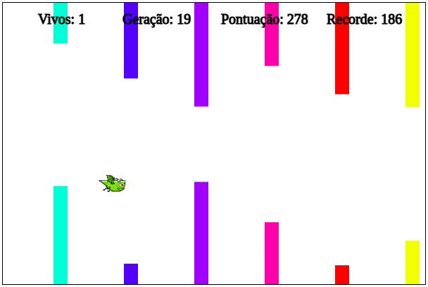
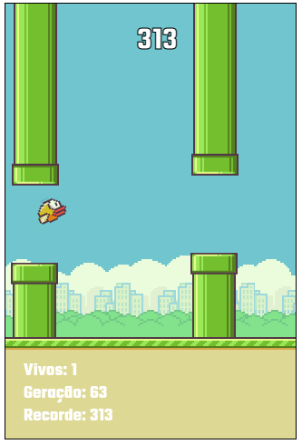

# Machine learning
<a href="https://matheusfd3.github.io/IA-flappy-bird/">https://matheusfd3.github.io/IA-flappy-bird/</a>
## Introdução
Uma inteligência artificial para ensinar o passarinho do Flappy Bird a passar entre os obstáculos, usando Redes Neurais e um Algoritmo Genético.
## Rede neural
Bom, para começarmos a entender como funciona primeiro precisamos entender como nós humanos conseguimos jogar um jogo como o Flappy Bird. Concorda comigo que para um humano jogar nós precisamos processar duas informações essenciais: altura do pássaro e a altura do gap, e o que fazemos? Colocamos o pássaro na mesma altura do gap. E adivinha? É exatamente isso que a nossa rede neural vai precisar para conseguir jogar, e o mais legal disso é que ela vai aprender isso sozinha, só vamos dar as informações que ela precisa, mas ela não sabe como processar essas informações ainda.
### Entradas
<ul>
  <li>Altura do pássaro</li>
  <li>Altura do Gap</li>
</ul>

### Saídas
Com as nossas entradas, a rede faz o processamento dela e retorna um valor entre 0 e 1. Eu defini que o valor de saída faz o seguinte:
<ul>
  <li>saída > 0.50 = voa.</li>
  <li>saída < 0.50 = Não voa.</li>
</ul>

## Algoritmo genético
Cada Geração consiste em 250 redes neurais (Genomas).
Cada genoma é testado no jogo, mapeando constantemente as entradas de leitura do jogo para as entradas da rede neural e obtendo a saída/ativação da rede que define se o pássaro voa ou não.
Ao testar cada genoma, acompanhamos sua "aptidão" contando obstáculos ultrapassados no jogo.
Quando uma geração inteira morre, selecionamos os dois melhores e em seguida aplicamos mutações na Rede Neural, criando um novo genoma.
Fazemos o cruzamento/mutação até obtermos 250 genomas novamente e repetimos constantemente até nascer uma rede neural capaz de jogar sem dificuldade.
## Informações
Pode demorar um pouco ou até parecer que as redes não estão evoluindo, mas com paciência e no decorrer de gerações você verá a evolução diante dos seus olhos. Pelos meus testes você não vai precisar mais que 50 gerações.
### Assista essa beleza em ação no seu navegador.
<a href="https://matheusfd3.github.io/IA-flappy-bird/">https://matheusfd3.github.io/IA-flappy-bird/</a>

## Versões
### 1.0v
<h5 align="center">
  
</h5>

### 2.0v
<h5 align="center">
  
</h5>
